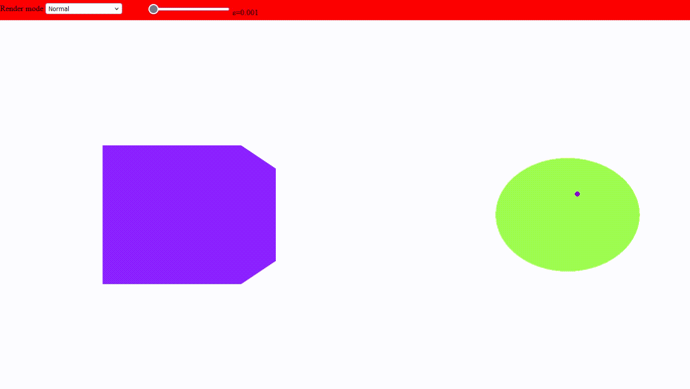
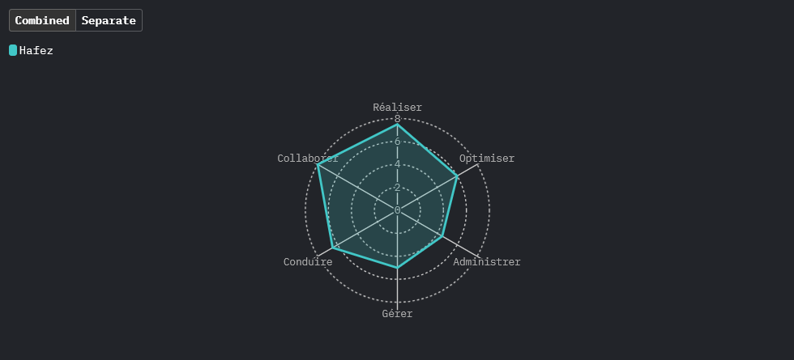

## A propos de moi

Bonjour ! Je suis Hafez, étudiant en 3ème année de BUT Info.\
J'aime l'informatique et la programmation, je souhaite faire carrière dans le développement informatique, plus précisément le développement backend.\
La technologie et la science m'intéressent également, je me tiens au courrant des dernières avancées.

Parcours:
- BUT Informatique (Actuellement)
- Baccalauréat spécialités Maths et NSI, mention bien (2021)

## Compétences

### Hard skills
- Programmation système:\

- Programmation de jeux vidéo:\

- Web:\

- Autres:\

### Soft skills
- Rigoureux: J'ai acquis une rigueur grâce aux projets que j'ai mené
- Autonome: Je sais travailler en autonomie
- Communication: J'ai l'habitude de travailler en équipe, je suis à l'aise avec la communication au sein d'un groupe

## Projets
J'ai pu participer au développement de plusieurs projets allant de simples CLI aux applications web en passant par des applications de bureau.
De nature curieuse je m'intéresse à tout, les projets que j'ai réalisé sont divers et variés:
- SAE 3.01A: Compléter un programme de raytracing en C++.

- SAE 4.01A: Développer une application utilisant le moteur de raytracing pour générer des images et métadonnées stockées dans une base de données.

- [💧Rain💧](https://mkdirs.github.io/rain/): Une animation de pluie faite entièrement en pure Javascript.

- [Kandi](https://mkdirs.github.io/kandi/): Un moteur de raymarching (WIP).

- [Papyrus](https://github.com/Mkdirs/papyrus): Un programme qui permet de dessiner via des scripts.

### Compétences acquises en BUT Info

#### Réaliser un développement d'application

  
#### Optimiser des applications
Introduit à l'algorithmie et structures de données, je sais reconnaître les parties d'un programme nécessitant une optimisation.

#### Administrer des systèmes informatiques communicants complexes
Je suis à l'aise avec l'écosystème Linux, je connais les commandes de base et je sais configurer le pare-feu d'un réseau informatique.
Mes SAE 3.01B et 4.01B témoignent de ces compétences, pour ces deux projets, j'ai dû créer un réseau informatique contenant plusieurs sous-réseaux. La sécurité du réseau était aussi un enjeu auquel il fallait répondre, en effet, certains services devaient pouvoir communiquer uniquement avec une partie du réseau et la communication avec l'extérieur devait être réduite au strict minimum.

#### Gérer des données de l'information
Je sais modéliser une base de données SQL en fonction d'un besoin, exploiter les données et les afficher.
Dans ma SAE 4.01A, l'un des enjeux était la création d'une base de données accueillant les différents traitements, images et métadonnées générés par l'application. En plus de la récupération de ces informations tout en gardant la cohérence entre les données reliées entre elles.

#### Conduire un projet
Les projets que j'ai mené m'ont appris à ne pas sous-estimer la phase d'analyse du projet pour déterminer les objéctifs, les outils à utiliser et compétences nécessaires.

#### Collaborer au sein d'une équipe informatique
J'ai l'habitude de travailler dans une équipe, je sais communiquer et je maîtrise les outils de collaboration dont Git.
